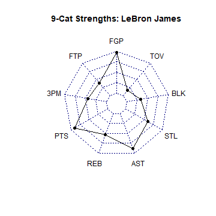
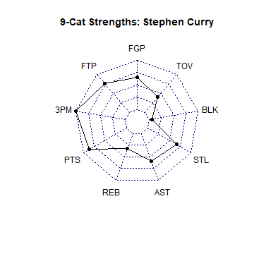

Average NBA Player Statistics of the 2017-2018 Regular Season 
========================================================
author: Joseph Fabia
date: September 16, 2018
transition: rotate


Overview
========================================================
<font size = "5">
This presentation serves as pitch for a Shiny App that was created for the Developing Data Products online course in Coursera. The application is available at this [link](https://jfabia.shinyapps.io/project9/), while the source code of the app is available at this [link](https://github.com/jfabia/project09). 

The inspiration for this project was my interest in Fantasy Basketball, which is based on statistical performance of NBA players. The shiny application is designed to provide the user a statistical overview of the an NBA player's performance during the 2017-2018 regular season. The app will prompt the user t select a player from a drop-down list of players who played. Once the user selects, the app will list out the following information:
- biographical information of the player (team, position, date of birth, height, weight)
- his per-game statistical averages across nine stat categories
- his rank relative to the players who were active during the 2017-2018 regular season
- a radar chart representing that player's statistical strengths relative to all other players
</font>

The Data
========================================================
<font size = "5">
Data is based on the 2017-2018 regular season total statistics data, which was retrieved from  [Basketball Reference](https://www.basketball-reference.com/). 

In order to scrape this data, the nbastatR package by [Alex Bresler](https://www.rdocumentation.org/collaborators/name/Alex%20Bresler) was used. Documentation to use this package is found [here](https://www.rdocumentation.org/packages/nbastatR/versions/0.1.110202031), and the actual code to retrieve this data is found [here](https://github.com/jfabia/project09/blob/master/nba_data_scraper.R) for reference.

Because the data is based on total statistics in the season, it had to be transformed into average statistics. Some data cleanup was required to remove duplicates or NA values. 

In order to rank a player's statistical strength, a player's Standard Score for each stat category was calculated. More information on the Standard Score approach can be found [here](https://en.wikipedia.org/wiki/Standard_score). Also, in order to apply Standard Scoring to Field Goal Efficiency and Free Throw Efficiency, these had to be transformed into counting variables, the methods which are described in this [blog post](http://statdance.blogspot.com/2014/01/how-do-espn-and-yahoo-rank-fantasy.html) by [Michael Muskett](https://plus.google.com/117257364176035644864), and this [reddit link](https://www.reddit.com/r/fantasybball/comments/71bdq0/how_to_calculate_weighted_zscore_for_fg/dn9javm/) by reddit user [nwsy96](https://www.reddit.com/user/nwsy96).

The actual code used to transform, clean and rank the data is found [here](https://github.com/jfabia/project09/blob/master/nba_data_transform.R)

</font>

Some Reproducible Code
========================================================
<font size = '4'>
The following tables demonstrate how far the top 150 players are from the rest of the population based on the five known statistics: Points, Rebounds, Assists, Steals and Blocks.</font><br>
<font size = '4'>

```
[1] "Top 150 Players"
```

```r
summary(avg[1:150,c("PTS","REB","AST","STL","BLK")])
```

```
      PTS              REB              AST               STL        
 Min.   : 7.143   Min.   : 1.887   Min.   : 0.6098   Min.   :0.3117  
 1st Qu.:12.126   1st Qu.: 3.858   1st Qu.: 1.5875   1st Qu.:0.7304  
 Median :14.024   Median : 5.120   Median : 2.5754   Median :0.9789  
 Mean   :15.475   Mean   : 5.732   Mean   : 3.2372   Mean   :1.0380  
 3rd Qu.:17.954   3rd Qu.: 6.908   3rd Qu.: 4.6511   3rd Qu.:1.3333  
 Max.   :30.431   Max.   :15.987   Max.   :10.2500   Max.   :2.3600  
      BLK         
 Min.   :0.08571  
 1st Qu.:0.27187  
 Median :0.46621  
 Mean   :0.64640  
 3rd Qu.:0.86544  
 Max.   :2.57333  
```
</font>
*** 
<font size = '4'>

```
[1] "Entire League of Active Players"
```

```r
summary(avg[,c("PTS","REB","AST","STL","BLK")])
```

```
      PTS               REB              AST               STL        
 Min.   : 0.4615   Min.   : 0.000   Min.   : 0.0000   Min.   :0.0000  
 1st Qu.: 4.5349   1st Qu.: 1.954   1st Qu.: 0.7964   1st Qu.:0.3545  
 Median : 7.7188   Median : 3.134   Median : 1.4444   Median :0.5949  
 Mean   : 8.9751   Mean   : 3.684   Mean   : 2.0017   Mean   :0.6705  
 3rd Qu.:12.4274   3rd Qu.: 4.738   3rd Qu.: 2.7291   3rd Qu.:0.9000  
 Max.   :30.4306   Max.   :15.987   Max.   :10.2500   Max.   :2.3600  
      BLK        
 Min.   :0.0000  
 1st Qu.:0.1478  
 Median :0.2807  
 Mean   :0.4082  
 3rd Qu.:0.5287  
 Max.   :2.5733  
```
</font>

Radar Charts for Statistical Strengths
========================================================
<font size = '4'>
The application will generate radar charts that assess the strengths of a selected player, as seen in the example below. The examples show that LeBron Jame's strengths are his shooting efficiency (FGP) and passing ability (AST), while Stephen Curry's strength is his 3-point shooting (3PM). </font>
<br><br>
<font size = '4'>

*** 
<br><br><br><br><br><br><br><br>

